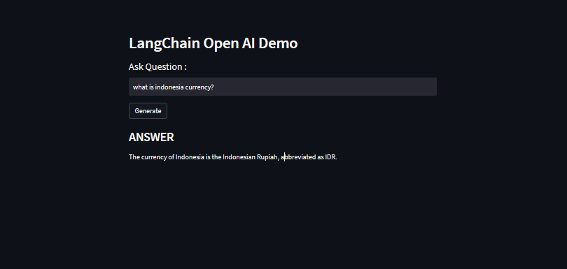

# LangChain Open AI Testing

This project is a simple web-based application built using **Streamlit** that interacts with OpenAI’s API. You can input a question, and the application will provide an answer by making a request to OpenAI's language model.



## Features

- Input a question in the text box.
- The app queries OpenAI’s API using **LangChain** to retrieve the answer.
- The answer is displayed below the input box in real-time.

## Installation

To run this project locally, follow the instructions below.

### Prerequisites

Ensure you have the following installed:

- Python 3.x
- OpenAI API key

### Setup

1. Install dependencies using the `requirements.txt` file:

    ```bash
    pip install -r requirements.txt
    ```

2. Create a `.env` file in the root directory and add your OpenAI API key:

    ```bash
    OPENAI_API_KEY=your_openai_api_key
    ```

3. Run the app using Streamlit:

    ```bash
    streamlit run app.py
    ```

4. The application should open in your browser. You can ask any question, and the app will generate answers using OpenAI’s model.

## Technologies Used

- **Streamlit**: A framework for creating beautiful web apps with Python.
- **LangChain**: A framework for connecting to and using language models like OpenAI.
- **OpenAI API**: The AI engine that powers the question-answering feature.

## Files

- `app.py`: Main application code that handles the user interface and OpenAI API interaction.
- `requirements.txt`: File containing necessary dependencies.

## Future Improvements

- Add more customization for the types of questions the app can handle.
- Implement error handling for cases where the OpenAI API request fails.
- Improve the user interface for a more engaging experience.
